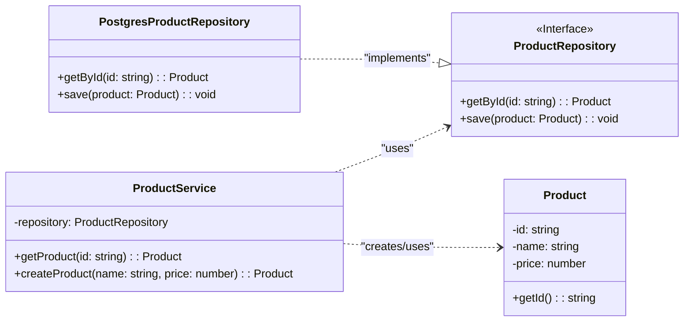

# 類別/組件關係文檔 (Class/Component Relationships Document) - [專案名稱]

---

**文件版本 (Document Version):** `v1.0`

**最後更新 (Last Updated):** `YYYY-MM-DD`

**主要作者 (Lead Author):** `[請填寫]`

**審核者 (Reviewers):** `[列出主要審核人員/團隊]`

**狀態 (Status):** `[例如：草稿 (Draft), 審核中 (In Review), 已批准 (Approved)]`

**相關設計文檔 (Related Design Documents):**
*   系統架構文檔 (SA): `[連結到 02_system_architecture_document.md]`
*   系統詳細設計文檔 (SD): `[連結到 03_system_design_document.md]`

---

## 目錄 (Table of Contents)

1.  [概述 (Overview)](#1-概述-overview)
2.  [核心類別圖 (Core Class Diagram)](#2-核心類別圖-core-class-diagram)
3.  [主要類別/組件職責 (Key Class/Component Responsibilities)](#3-主要類別組件職責-key-classcomponent-responsibilities)
4.  [關係詳解 (Relationship Details)](#4-關係詳解-relationship-details)
5.  [設計模式應用 (Design Pattern Applications)](#5-設計模式應用-design-pattern-applications)
6.  [SOLID 原則遵循情況 (SOLID Principles Adherence)](#6-solid-原則遵循情況-solid-principles-adherence)
7.  [接口契約 (Interface Contracts)](#7-接口契約-interface-contracts)
8.  [技術選型與依賴 (Technical Choices & Dependencies)](#8-技術選型與依賴-technical-choices--dependencies)
9.  [附錄 (Appendix)](#9-附錄-appendix)

---

## 1. 概述 (Overview)

### 1.1 文檔目的 (Document Purpose)
*   本文檔旨在通過 UML 類別圖和詳細描述，清晰地呈現 [專案名稱] 中主要類別、組件和接口之間的靜態結構關係。
*   它作為開發團隊理解和維護代碼庫結構的關鍵參考，並確保設計遵循良好的物件導向原則。

### 1.2 建模範圍 (Modeling Scope)
*   **包含範圍**: `[例如：核心業務邏輯類別、資料模型 (Entities)、服務類別、主要介面、領域物件等]`
*   **排除範圍**: `[例如：UI 組件、第三方函式庫的內部類別、測試專用類別、生成的代碼等]`
*   **抽象層級**: `[例如：專注於公開的屬性 (public properties) 和方法 (methods)，忽略實現細節]`

### 1.3 UML 符號說明 (UML Notation Conventions)
*   **繼承 (Inheritance):** `--|>` (is-a) - 子類別繼承父類別。
*   **實現 (Implementation):** `..|>` (implements) - 類別實現接口。
*   **組合 (Composition):** `*--` (has-a, strong ownership) - 組件的生命週期依賴於容器。
*   **聚合 (Aggregation):** `o--` (has-a, weak ownership) - 組件的生命週期獨立於容器。
*   **依賴 (Dependency):** `..>` (uses-a) - 一個類別的方法使用了另一個類別。
*   **關聯 (Association):** `-->` (has-a) - 類別之間的一般關係。

---

## 2. 核心類別圖 (Core Class Diagram)

*   `[使用 Mermaid 語法繪製核心模組的類別圖。此圖應展示最重要的類別及其關係，作為系統結構的快照。]`

*   **圖表說明:** `[對上述圖表進行簡要說明，解釋主要的交互流程和設計思想。例如：ProductService 依賴 ProductRepository 接口來實現數據持久化，具體的實現由 PostgresProductRepository 提供，遵循了依賴反轉原則。]`

---

## 3. 主要類別/組件職責 (Key Class/Component Responsibilities)

*   `[以表格形式列出圖中的主要類別、接口或組件，並詳細描述其職責。]`

| 類別/組件 (Class/Component) | 核心職責 (Core Responsibility)                                | 主要協作者 (Key Collaborators) | (選填) 所屬模組 |
| :-------------------------- | :------------------------------------------------------------ | :----------------------------- | :-------------- |
| `ProductService`            | `處理與產品相關的業務邏輯，例如創建、查詢產品。`              | `ProductRepository`, `Product` | `services`      |
| `ProductRepository` (Interface) | `定義產品數據的持久化操作契約，例如讀取和儲存。`              | `Product`                      | `repositories`  |
| `PostgresProductRepository` | `ProductRepository 接口的具體實現，負責與 PostgreSQL 資料庫交互。` | `Product`                      | `repositories`  |
| `Product`                   | `代表產品的領域模型 (Domain Model)，包含產品的屬性和基本行為。` | -                              | `models`        |
| ...                         | ...                                                           | ...                            | ...             |

---

## 4. 關係詳解 (Relationship Details)

### 4.1 繼承/實現 (Inheritance/Implementation)
*   `[描述專案中關鍵的繼承或實現關係，並解釋其設計目的。]`
    *   **`PostgresProductRepository` implements `ProductRepository`:** 這是策略模式和依賴反轉的應用。`ProductService` 不直接依賴具體的數據庫實現，而是依賴抽象的 `ProductRepository` 接口。這使得未來可以輕鬆替換數據庫實現（例如，換成 `MongoProductRepository`）而無需修改 `ProductService`。

### 4.2 組合/聚合 (Composition/Aggregation)
*   `[描述專案中重要的組合或聚合關係。]`
    *   *範例: 一個 `Order` 類別可能組合 (Composition) 多個 `OrderItem` 類別。`OrderItem` 的生命週期完全依賴於 `Order`。*

### 4.3 依賴 (Dependency)
*   `[描述關鍵的依賴關係。]`
    *   **`ProductService` uses `ProductRepository`:** `ProductService` 的功能需要 `ProductRepository` 來完成，但它不擁有 `ProductRepository` 的實例，通常是通過依賴注入 (Dependency Injection) 傳入。

---

## 5. 設計模式應用 (Design Pattern Applications)

*   `[列出並描述在此設計中應用的主要設計模式及其動機。]`

| 設計模式 (Design Pattern) | 應用場景/涉及類別                                            | 設計目的/解決的問題                                          |
| :------------------------ | :----------------------------------------------------------- | :----------------------------------------------------------- |
| **策略模式 (Strategy)**   | `ProductService` 使用 `ProductRepository` 接口。           | `將數據訪問邏輯從業務邏輯中分離，允許在運行時切換不同的數據庫實現。` |
| **工廠模式 (Factory)**    | `[例如：用於創建複雜物件的工廠類別]`                         | `[例如：封裝物件的創建過程，使客戶端代碼與具體類別解耦。]`     |
| **單例模式 (Singleton)**  | `[例如：配置管理類、資料庫連接池]`                         | `[確保一個類別只有一個實例，並提供一個全局訪問點。]`         |
| **依賴注入 (DI)**         | `ProductRepository` 實例被注入到 `ProductService` 中。     | `降低組件之間的耦合度，提高代碼的可測試性和可維護性。`       |
| ...                       | ...                                                          | ...                                                          |

---

## 6. SOLID 原則遵循情況 (SOLID Principles Adherence)

*   `[簡要評估核心設計是否遵循 SOLID 原則。這有助於保證代碼的質量和可維護性。]`

*   `[ ]` **S - 單一職責原則 (Single Responsibility Principle):**
    *   `[評估：每個類別是否只有一個引起其變更的原因？例如，ProductService 負責業務邏輯，Repository 負責數據持久化。]`
*   `[ ]` **O - 開放/封閉原則 (Open/Closed Principle):**
    *   `[評估：系統是否對擴展開放，對修改封閉？例如，新增一個數據庫支持時，只需新增 Repository 實現，無需修改 Service。]`
*   `[ ]` **L - 里氏替換原則 (Liskov Substitution Principle):**
    *   `[評估：子類別的實例是否可以替換其父類別的實例而不影響程式的正確性？]`
*   `[ ]` **I - 介面隔離原則 (Interface Segregation Principle):**
    *   `[評估：介面是否小而專一？客戶端是否不應被強迫依賴它們不使用的方法？]`
*   `[ ]` **D - 依賴反轉原則 (Dependency Inversion Principle):**
    *   `[評估：高層模組是否不依賴於低層模組，兩者都應依賴於抽象？例如，Service 依賴 Repository 接口，而非具體實現。]`

---

## 7. 接口契約 (Interface Contracts)

*   `[對於系統中定義的重要接口，在此提供更詳細的契約說明。]`

### 7.1 `ProductRepository`
*   **目的:** 定義與產品數據持久化相關的所有操作。
*   **方法 (Methods):**
    *   `getById(id: string): Product`
        *   **描述:** 根據提供的 ID 查找並返回一個 `Product` 物件。
        *   **前置條件:** `id` 必須是一個有效的字串。
        *   **後置條件:** 如果找到，返回對應的 `Product` 物件；如果未找到，則 `[拋出 NotFoundException / 返回 null]`。
    *   `save(product: Product): void`
        *   **描述:** 將一個 `Product` 物件儲存或更新到數據源。
        *   **前置條件:** `product` 是一個有效的 `Product` 實例。
        *   **後置條件:** `product` 的狀態已被持久化。

---

## 8. 技術選型與依賴 (Technical Choices & Dependencies)

*   `[列出支撐上述類別/組件實現所採用的語言、框架、庫、運行時與基礎設施依賴，並給出簡要理由，關聯 ADR。]`

| 類別/組件 | 語言/框架 | 關鍵庫/工具 | 版本/約束 | 適用範圍 | 選擇理由 | 備選方案 | 風險/成熟度 | 關聯 ADR |
| :-- | :-- | :-- | :-- | :-- | :-- | :-- | :-- | :-- |
| `ProductService` | Python / FastAPI | Pydantic, Dependency Injection | Python 3.11+ | API 層/服務層 | 開發效率高，契約清晰 | Node/Express | 成熟 | ADR-001 |
| `PostgresProductRepository` | Python | SQLAlchemy | 2.x | 資料訪問 | ORM 穩定，社群大 | psycopg 原生 | 成熟 | ADR-002 |
| `Product` | Python | dataclasses/pydantic | - | Domain | 型別安全、序列化友好 | 自定義模型 | 成熟 | ADR-003 |
| ... | ... | ... | ... | ... | ... | ... | ... | ... |

- 外部依賴（基礎設施/雲服務）：`PostgreSQL`, `Redis`, `Object Storage (S3)` 等，請標註用途與關鍵配置（例如連線池、重試策略）。
- 非功能約束（NFR）：性能/可用性/安全/可觀測性最低要求與對應支持（如結構化日誌、健康檢查）。

> 提示：若技術選型牽涉設計權衡，請建立對應 ADR，並在上表 `關聯 ADR` 欄位填入編號（如 ADR-004）。

---

## 9. 附錄 (Appendix)

*   `[可以包含任何補充信息，例如更詳細的、針對特定子模組的類別圖，或關於特定設計決策的深入討論。]`

---
**文件審核記錄 (Review History):**

| 日期       | 審核人     | 版本 | 變更摘要/主要反饋 |
| :--------- | :--------- | :--- | :---------------- |
| YYYY-MM-DD | [姓名/團隊] | v1.0 | 初稿提交          | 