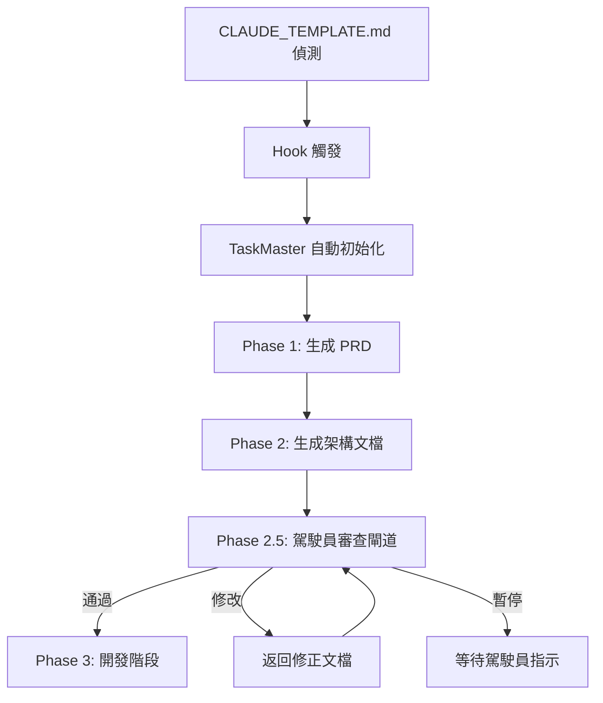

# 🚀 TaskMaster & Claude Code Collective

**人類主導的智能任務協調平台**

## 🎯 核心理念

**人類是鋼彈駕駛員，TaskMaster 是智能副駕駛**
- 人類保持所有重要決策的控制權
- TaskMaster 提供智能建議和協調
- 完全透明的執行狀態和決策過程

## 📋 系統功能

### 🎛️ 主要命令

| 命令 | 功能 | 說明 |
|------|------|------|
| `/task-init [project]` | 專案初始化 | 基於 VibeCoding 範本生成文檔導向任務流程 |
| `/task-status` | 狀態查詢 | 查看專案、任務、Hub 狀態 |
| `/task-next` | 下個任務 | 獲得 Hub 智能建議的下個任務 |
| `/hub-delegate [agent]` | 智能體委派 | Hub 協調的 Subagent 委派 |

### 🔄 升級的現有命令

| 命令 | 原功能 | 升級後 |
|------|--------|---------|
| `/suggest-mode` | Subagent 建議頻率 | TaskMaster 模式控制 |
| `/review-code` | 程式碼審查 | Hub 協調的智能審查 |
| `/check-quality` | 品質檢查 | 全面品質協調 |
| `/template-check` | 範本檢查 | 範本驅動任務生成 |

## 🏗️ 系統架構

```
TaskMaster Core
├── HumanTaskManager      → 任務管理
├── HubController         → Hub-and-Spoke 協調
├── TaskPersistence       → 資料持久化
├── VibeCodingBridge      → 範本整合
└── WBSTodoManager        → WBS Todo 管理
```

### 🎯 Hub-and-Spoke 協調

TaskMaster 使用 Hub-and-Spoke 架構：
- **Hub**: 中央協調器，分析任務並建議最佳 Subagent
- **Spoke**: 各種專業 Subagent（程式碼品質、安全、測試等）
- **Human Pilot**: 人類駕駛員，所有決策最終確認者

## 📄 文檔導向工作流程

### 🎯 整體流程概覽



### 🔍 文檔導向三階段

1. **Phase 1**: 基於 VibeCoding 範本生成 PRD 等核心文檔
2. **Phase 2**: 生成架構、API、模組規格文檔
3. **Phase 2.5**: 駕駛員審查閘道（關鍵檢查點）
4. **Phase 3+**: 通過審查後進入開發階段

## 📊 WBS Todo List 系統

### 🎯 統一狀態管理

TaskMaster 提供完整的 WBS (Work Breakdown Structure) Todo List，支援文檔導向流程：

```json
{
  "projectContext": {
    "name": "project-name",
    "startDate": "2024-01-01",
    "currentPhase": "Phase 1 - 文檔生成階段"
  },
  "currentTask": {
    "id": "task-001",
    "title": "產生專案需求文檔 (PRD)",
    "deliverable": "docs/PRD.md",
    "reviewRequired": true,
    "hubSuggestion": "workflow-template-manager",
    "confidence": 0.9
  },
  "todos": [
    {
      "id": "task-001",
      "status": "in_progress",
      "assignedAgent": "workflow-template-manager",
      "progress": 60,
      "deliverable": "docs/PRD.md",
      "reviewRequired": true,
      "blockers": [],
      "startTime": "2024-01-01T10:00:00Z",
      "estimatedEnd": "2024-01-01T11:00:00Z"
    },
    {
      "id": "task-005",
      "title": "**等待駕駛員審查 Phase 1-2 文檔**",
      "isGate": true,
      "phase": "Phase 2.5",
      "reviewRequired": true,
      "status": "pending"
    }
  ]
}
```

### 📈 即時狀態更新

- **文檔生成任務**: 自動生成 Phase 1-2 的項目文檔
- **審查閘道**: 明確的駕駛員審查檢查點
- **進度追蹤**: 即時更新任務進度和交付物狀態
- **阻礙記錄**: 自動記錄遇到的問題和阻礙
- **完成追蹤**: 記錄文檔完成和審查狀態

### 🎯 人類全局掌控

```bash
# 查看完整專案狀態
/task-status --detailed

# 顯示：
📊 專案總覽: ProjectName
├── 📋 總任務: 15 個
├── ✅ 已完成: 8 個 (53%)
├── 🔄 進行中: 2 個
├── ⏳ 待處理: 4 個
├── ❌ 受阻: 1 個

🎯 當前任務: task-001 (產生專案需求文檔)
├── 📄 交付物: docs/PRD.md
├── 🤖 執行者: workflow-template-manager
├── ⏱️ 開始時間: 10:30
├── 📈 進度: 75%
├── 🔍 駕駛員審查: 待生成後審查

📊 WBS 狀態:
├── Phase 1: 文檔生成 🔄 (75% - PRD 生成中)
├── Phase 2: 架構文檔 ⏳ (0% - 待 Phase 1 完成)
├── Phase 2.5: 駕駛員審查閘道 ⏳ (等待文檔完成)
├── Phase 3: 開發階段 🔒 (鎖定直到審查通過)
├── Phase 3: 核心功能 ⏳ (0%)
```

## 🔧 安裝和使用

### 1. 初始化專案
```bash
/task-init my-project
```

TaskMaster 將會：
1. 分析專案需求
2. 載入相關 VibeCoding 範本
3. 生成智能任務列表
4. 建立 WBS Todo List
5. 等待人類確認

### 2. 查看狀態
```bash
/task-status
```

### 3. 執行下個任務
```bash
/task-next
```

TaskMaster Hub 將分析並建議最佳執行策略。

### 4. 委派任務
```bash
/hub-delegate code-quality-specialist
```

## 🤖 Subagent 整合

### 🔍 當前狀態

TaskMaster 已準備好與 Subagent 整合，但需要了解：

1. **調用機制**: Subagent 是如何被調用的？
2. **資訊共享**: 任務資訊是否可以傳遞給 Subagent？
3. **狀態回報**: Subagent 是否可以回報執行狀態？
4. **結果收集**: 如何收集 Subagent 的執行結果？

### 🔧 待實現的整合點

```javascript
// 在 taskmaster.js 中的 callSubagent 方法
async callSubagent(task, agent, hubAnalysis) {
    // TODO: 實現與 Claude Code Subagent 的實際通信
    // 需要了解：
    // 1. 如何調用特定的 Subagent
    // 2. 如何傳遞任務上下文和 WBS 資訊
    // 3. 如何接收執行結果和狀態更新
    // 4. 如何處理執行失敗和錯誤
}
```

## 🛡️ 人類控制機制

### 🎛️ 即時控制

- **暫停**: 隨時暫停 TaskMaster 執行
- **停止**: 緊急停止所有自動化
- **接管**: 切換到完全手動模式
- **覆蓋**: 覆蓋任何 Hub 建議

### 🔍 完全透明

- 所有決策過程可見
- 任務執行狀態即時更新
- 風險和問題及時提醒
- 執行歷史完整記錄

## 📁 檔案結構

```
.claude/
├── taskmaster.js              → 主要系統檔案
├── TASKMASTER_README.md       → 本說明文件
├── commands/                  → Slash 命令定義
│   ├── task-init.md
│   ├── task-status.md
│   ├── task-next.md
│   ├── hub-delegate.md
│   ├── suggest-mode.md        → (升級)
│   ├── review-code.md         → (升級)
│   ├── check-quality.md       → (升級)
│   └── template-check.md      → (升級)
└── taskmaster-data/          → 持久化資料
    ├── project.json           → 專案配置
    └── wbs-todos.json         → WBS Todo 狀態
```

## 🚀 開始使用

1. 確保 `.claude/taskmaster.js` 已正確放置
2. 使用 `/task-init project-name` 初始化第一個專案
3. 使用 `/task-status` 查看狀態
4. 使用 `/task-next` 開始智能任務協調

**Ready to pilot your development with TaskMaster!** 🤖⚔️