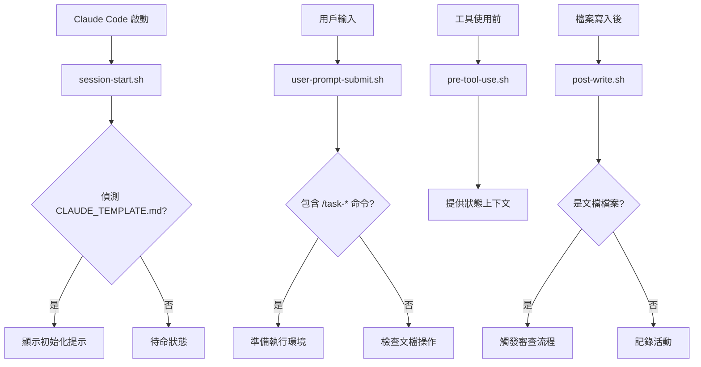

# 🪝 TaskMaster Hooks 系統

## 📁 檔案結構

```
.claude/hooks/
├── README.md                    # 本文件：Hooks 系統說明
├── hook-utils.sh               # 共用工具函數庫
├── session-start.sh            # 會話開始 Hook
├── user-prompt-submit.sh       # 用戶輸入提交 Hook
├── pre-tool-use.sh            # 工具使用前 Hook
└── post-write.sh              # 檔案寫入後 Hook
```

## 🎯 Hook 功能說明

### 1. `session-start.sh`
**觸發時機**: Claude Code 會話開始時

**主要功能**:
- 自動檢測 `CLAUDE_TEMPLATE.md` 檔案
- 判斷是否需要初始化 TaskMaster
- 顯示初始化提示訊息
- 調用 TaskMaster Node.js 處理器

**使用場景**:
```bash
# 每次啟動 Claude Code 時自動執行
# 無需手動調用
```

### 2. `user-prompt-submit.sh`
**觸發時機**: 用戶提交 prompt 時

**主要功能**:
- 檢測 TaskMaster 相關命令 (`/task-*`)
- 識別文檔相關操作
- 準備初始化環境
- 更新系統狀態

**使用場景**:
```bash
# 當用戶輸入包含以下內容時觸發：
# - /task-init
# - /task-status
# - /task-next
# - /hub-delegate
# - docs/ 路徑
# - .md 檔案操作
```

### 3. `pre-tool-use.sh`
**觸發時機**: Claude Code 工具使用前

**主要功能**:
- 提供 TaskMaster 狀態上下文
- 顯示當前專案資訊
- 工具特定的預處理
- 智能體委派準備

**支援工具**:
- `Write`: 檔案寫入提示
- `Edit`: 核心檔案編輯警告
- `Read`: VibeCoding 範本讀取上下文
- `Task`: 智能體委派準備

### 4. `post-write.sh`
**觸發時機**: Claude Code 寫入檔案後

**主要功能**:
- 檢測文檔檔案生成
- 觸發駕駛員審查流程
- 更新 TaskMaster 狀態
- 顯示審查通知

**監控檔案類型**:
- 專案文檔 (`docs/*.md`)
- VibeCoding 範本
- TaskMaster 核心檔案
- Hooks 配置檔案

### 5. `hook-utils.sh`
**功能**: 共用工具函數庫

**提供函數**:
- 日誌函數 (`log_info`, `log_success`, `log_warning`, `log_error`)
- 狀態檢查 (`check_taskmaster_status`, `check_required_files`)
- 檔案類型判斷 (`is_document_file`, `is_project_document`)
- 駕駛員通知 (`show_driver_notification`)
- 環境驗證 (`validate_environment`)

## 🔧 設定和使用

### 1. 權限設定
```bash
# 確保所有 hook 腳本具有執行權限
chmod +x .claude/hooks/*.sh
```

### 2. 環境變數
```bash
# 開啟除錯模式（可選）
export TASKMASTER_DEBUG=true
```

### 3. 日誌檔案
所有 Hook 活動記錄在：`.claude/hooks.log`

### 4. Claude Code 整合
hooks 通過 `.claude/settings.local.json` 整合到 Claude Code：

```json
{
  "hooks": {
    "SessionStart": [
      {
        "matcher": "*",
        "hooks": [
          {
            "type": "command",
            "command": ".claude/hooks/session-start.sh",
            "timeout": 30
          }
        ]
      }
    ],
    "UserPromptSubmit": [
      {
        "matcher": "*",
        "hooks": [
          {
            "type": "command",
            "command": ".claude/hooks/user-prompt-submit.sh '{{content}}'",
            "timeout": 15
          }
        ]
      }
    ]
  }
}
```

## 🎯 Hook 執行流程



## 🛠️ 自定義 Hooks

### 創建新 Hook
```bash
# 1. 創建新的 hook 腳本
touch .claude/hooks/my-custom-hook.sh
chmod +x .claude/hooks/my-custom-hook.sh

# 2. 加入基本結構
cat << 'EOF' > .claude/hooks/my-custom-hook.sh
#!/bin/bash

# 載入共用工具函數
SCRIPT_DIR="$(cd "$(dirname "${BASH_SOURCE[0]}")" && pwd)"
source "$SCRIPT_DIR/hook-utils.sh"

# Hook 主邏輯
log_info "自定義 Hook 執行中..."
EOF

# 3. 在 settings.local.json 中註冊
```

### Hook 最佳實踐
1. **總是載入 `hook-utils.sh`** 使用共用函數
2. **適當的日誌記錄** 便於除錯和監控
3. **錯誤處理** 使用 `set -e` 和適當的錯誤檢查
4. **效能考慮** hooks 應該快速執行，避免阻塞
5. **狀態檢查** 在執行動作前檢查必要條件

## 🔍 除錯和監控

### 查看 Hook 日誌
```bash
# 實時監控 Hook 活動
tail -f .claude/hooks.log

# 查看最近的 Hook 活動
tail -n 50 .claude/hooks.log
```

### 手動測試 Hook
```bash
# 測試會話開始 Hook
.claude/hooks/session-start.sh

# 測試用戶輸入 Hook
.claude/hooks/user-prompt-submit.sh "/task-init MyProject"

# 測試檔案寫入 Hook
.claude/hooks/post-write.sh "docs/test.md"
```

### 除錯模式
```bash
# 啟用詳細日誌
export TASKMASTER_DEBUG=true

# 執行 Hook 查看除錯資訊
.claude/hooks/session-start.sh
```

---

**🎯 設計原則**: 所有 Hooks 都設計為非侵入性，確保即使在 Hook 失敗的情況下，Claude Code 的正常功能也不會受到影響。