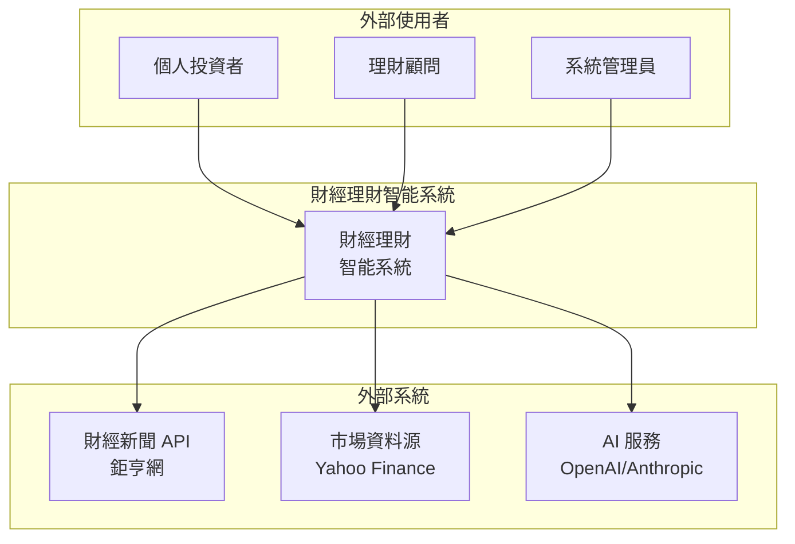
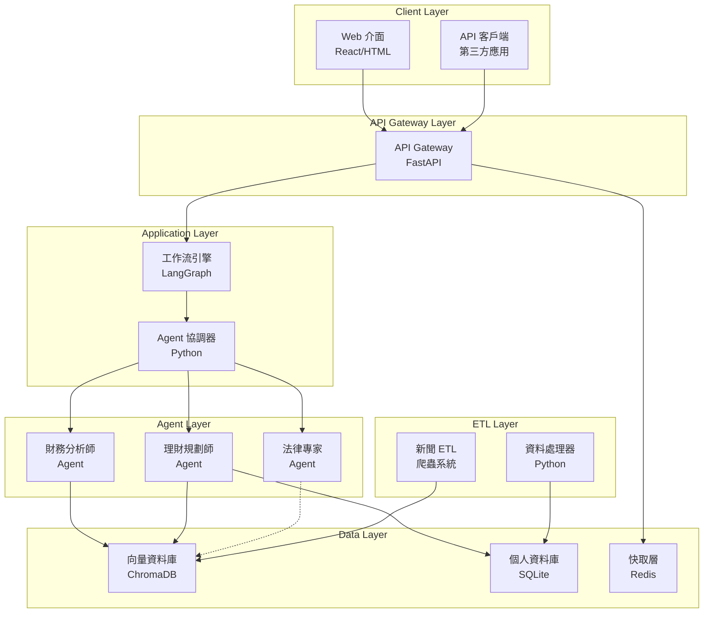
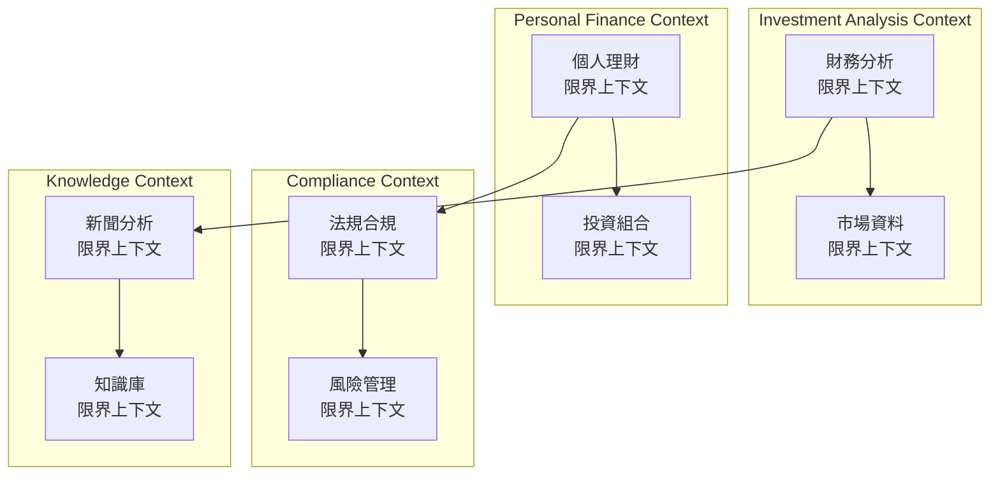
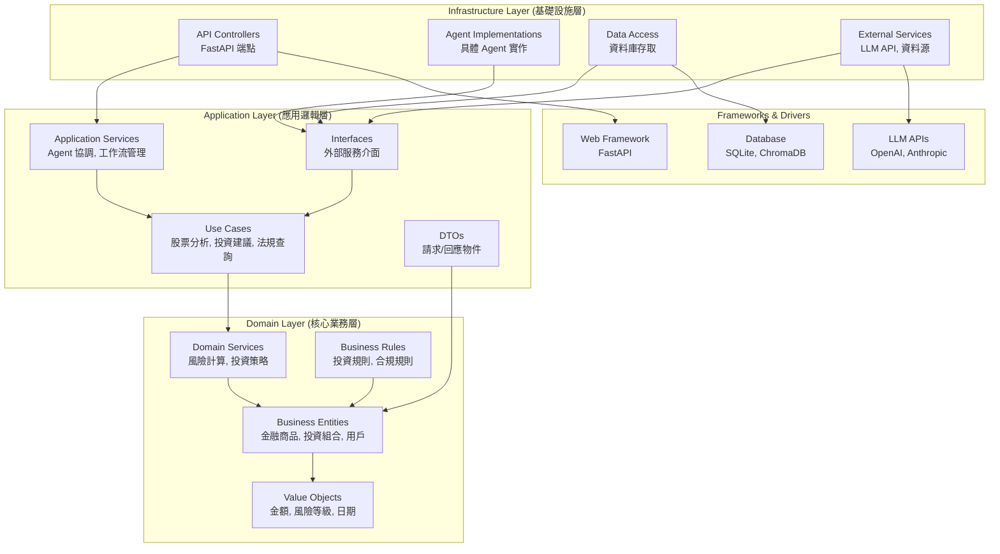
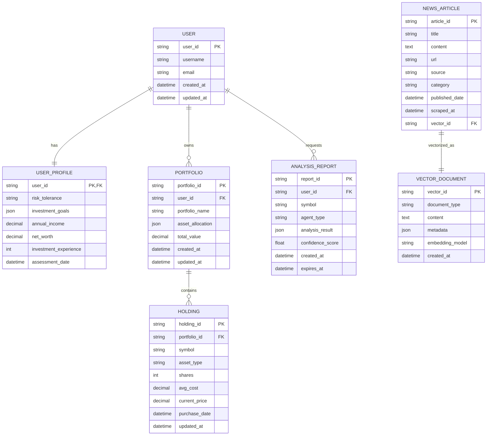
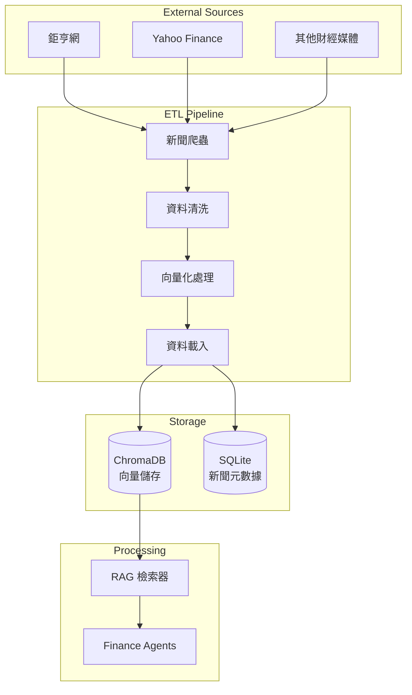
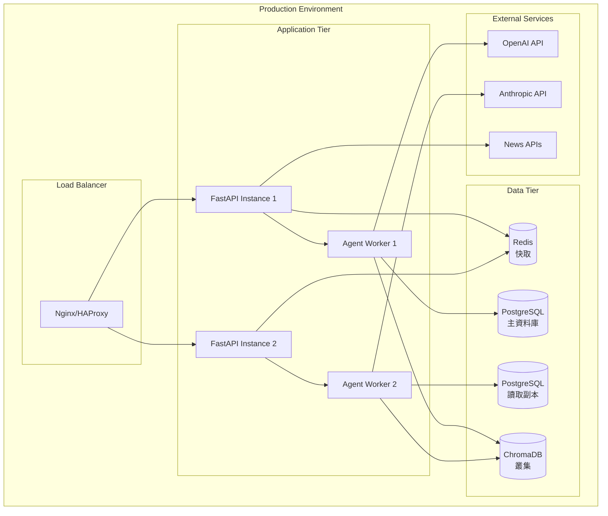
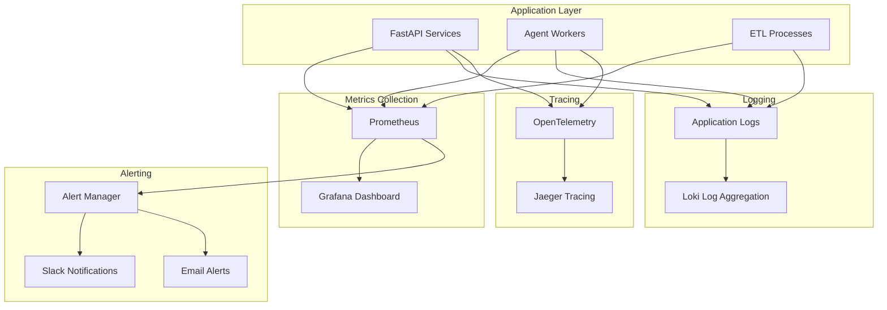

# 整合性架構與設計文件 - 財經理財智能系統

---

**文件版本 (Document Version):** `v1.0`
**最後更新 (Last Updated):** `2025-01-27`
**主要作者 (Lead Author):** `Claude AI 系統架構師`
**審核者 (Reviewers):** `AI 開發團隊, 金融領域專家`
**狀態 (Status):** `已批准 (Approved)`

---

## 目錄 (Table of Contents)

- [第 1 部分：架構總覽 (Architecture Overview)](#第-1-部分架構總覽-architecture-overview)
  - [1.1 C4 模型：視覺化架構](#11-c4-模型視覺化架構)
  - [1.2 DDD 戰略設計 (Strategic DDD)](#12-ddd-戰略設計-strategic-ddd)
  - [1.3 Clean Architecture 分層](#13-clean-architecture-分層)
  - [1.4 技術選型與決策](#14-技術選型與決策)
- [第 2 部分：詳細設計 (Detailed Design)](#第-2-部分詳細設計-detailed-design)
  - [2.1 MVP 與模組優先級 (MVP & Module Priority)](#21-mvp-與模組優先級-mvp--module-priority)
  - [2.2 核心功能：模組設計](#22-核心功能模組設計)
  - [2.3 非功能性需求設計 (NFRs Design)](#23-非功能性需求設計-nfrs-design)
- [第 3 部分：附錄 (Appendix)](#第-3-部分附錄-appendix)

---

**目的**: 本文件旨在將財經理財智能系統的業務需求轉化為完整、內聚的技術藍圖。從高層次的多 Agent 系統架構開始，逐步深入到具體的模組實現細節，確保系統的穩固性與可維護性。

---

## 第 1 部分：架構總覽 (Architecture Overview)

### 1.1 C4 模型：視覺化架構

#### L1 - 系統情境圖 (System Context Diagram)



#### L2 - 容器圖 (Container Diagram)



#### L3 - 元件圖 (Component Diagram) - Agent Layer

```mermaid
graph TB
    subgraph "Agent Base Infrastructure"
        BaseAgent[BaseAgent<br/>抽象基類]
        AgentMessage[AgentMessage<br/>訊息結構]
        AgentRegistry[AgentRegistry<br/>註冊管理]
    end

    subgraph "Financial Analyst Agent"
        FinAnalyst[FinancialAnalystAgent]
        TechAnalysis[技術分析<br/>模組]
        FundAnalysis[基本面分析<br/>模組]
        RiskAssessment[風險評估<br/>模組]
    end

    subgraph "Financial Planner Agent"
        FinPlanner[FinancialPlannerAgent]
        RiskProfiling[風險評估<br/>模組]
        AssetAllocation[資產配置<br/>模組]
        PortfolioOpt[組合優化<br/>模組]
    end

    subgraph "Legal Expert Agent"
        LegalExpert[LegalExpertAgent]
        RegCompliance[法規合規<br/>模組]
        RiskWarning[風險警示<br/>模組]
        LegalQuery[法規查詢<br/>模組]
    end

    BaseAgent <|-- FinAnalyst
    BaseAgent <|-- FinPlanner
    BaseAgent <|-- LegalExpert

    FinAnalyst --> TechAnalysis
    FinAnalyst --> FundAnalysis
    FinAnalyst --> RiskAssessment

    FinPlanner --> RiskProfiling
    FinPlanner --> AssetAllocation
    FinPlanner --> PortfolioOpt

    LegalExpert --> RegCompliance
    LegalExpert --> RiskWarning
    LegalExpert --> LegalQuery
```

### 1.2 DDD 戰略設計 (Strategic DDD)

#### 通用語言 (Ubiquitous Language)

| 術語 | 定義 | 英文對照 |
|------|------|----------|
| **財務分析師 Agent** | 專門負責股票、基金技術面與基本面分析的 AI 代理 | Financial Analyst Agent |
| **理財規劃師 Agent** | 負責個人化投資建議與資產配置的 AI 代理 | Financial Planner Agent |
| **法律專家 Agent** | 提供投資法規諮詢與合規檢查的 AI 代理 | Legal Expert Agent |
| **RAG 檢索** | 檢索增強生成，結合向量搜尋與 LLM 的智能問答技術 | Retrieval-Augmented Generation |
| **投資組合** | 用戶持有的股票、基金等金融商品集合 | Investment Portfolio |
| **風險偏好** | 投資者對投資風險的接受程度，分為保守、穩健、積極等級 | Risk Tolerance |
| **資產配置** | 將投資資金分配到不同資產類別的策略 | Asset Allocation |
| **合規檢查** | 確保投資行為符合相關法規的檢查程序 | Compliance Check |

#### 限界上下文 (Bounded Contexts)



### 1.3 Clean Architecture 分層



### 1.4 技術選型與決策

#### 架構決策記錄 (ADR)

| ADR ID | 決策主題 | 狀態 | 決策內容 |
|--------|----------|------|----------|
| **ADR-001** | 多 Agent 架構採用 | 已批准 | 使用 LangGraph + 自定義 Agent 基類的多 Agent 架構 |
| **ADR-002** | 向量資料庫選型 | 已批准 | 選擇 ChromaDB 作為向量資料庫，支援本地部署和雲端擴展 |
| **ADR-003** | LLM 服務提供商 | 已批准 | 主要使用 OpenAI GPT，Anthropic Claude 作為備用 |
| **ADR-004** | 個人資料庫選型 | 已批准 | 使用 SQLite 作為個人資料庫，支援未來升級至 PostgreSQL |
| **ADR-005** | API 框架選擇 | 已批准 | 使用 FastAPI 提供 RESTful API 服務 |
| **ADR-006** | Agent RAG 策略 | 已批准 | 財務和理財 Agent 共用 RAG，法律 Agent 使用純 Prompt |

---

## 2. 需求摘要 (Requirements Summary)

### 2.1 功能性需求摘要 (Functional Requirements Summary)

- **FR-1: 智能財務分析** (對應 US-001) - 提供股票、基金的技術面與基本面分析
- **FR-2: 個人化理財規劃** (對應 US-002) - 基於風險評估的資產配置建議
- **FR-3: 法規合規諮詢** (對應 US-003) - 投資法規查詢與合規檢查
- **FR-4: 即時新聞整合** (對應 US-004) - 財經新聞爬取、分析與推薦
- **FR-5: 投資組合管理** (對應 US-005) - 個人投資組合建立與追蹤
- **FR-6: RESTful API 服務** (對應 US-006) - 提供標準 API 介面供第三方整合

### 2.2 非功能性需求 (Non-Functional Requirements - NFRs)

| NFR 分類 | 具體需求描述 | 衡量指標/目標值 |
| :--- | :--- | :--- |
| **性能 (Performance)** | API 端點回應時間 | `< 2 秒 (P95)` |
| | Agent 分析處理時間 | `< 5 秒 (複雜分析)` |
| | 系統併發處理能力 | `支援 100 併發用戶` |
| **可擴展性 (Scalability)** | Agent 水平擴展能力 | `支援獨立擴展各 Agent` |
| | 資料庫擴展策略 | `支援從 SQLite 升級至 PostgreSQL` |
| **可用性 (Availability)** | 系統可用性 (SLA) | `99.5%` |
| | 錯誤恢復時間 | `< 5 分鐘` |
| **可靠性 (Reliability)** | 資料完整性保證 | `ACID 事務支援` |
| | Agent 回應準確率 | `> 85%` |
| **安全性 (Security)** | API 認證機制 | `JWT Token 認證` |
| | 資料傳輸加密 | `TLS 1.3+` |
| | 敏感資料加密 | `AES-256 加密` |
| **合規性 (Compliance)** | 個資保護 | `符合個資法要求` |
| | 投資建議免責 | `包含風險警語` |

---

## 3. 高層次架構設計 (High-Level Architectural Design)

### 3.1 選定的架構模式 (Chosen Architectural Pattern)

- **模式:** `多 Agent 架構 (Multi-Agent Architecture) + 微服務風格 (Microservices Style)`
- **選擇理由:**
  - 每個 Agent 代表不同的專業領域（財務分析、理財規劃、法律合規），符合領域驅動設計原則
  - Agent 之間低耦合，可獨立開發、測試和部署
  - 支援不同 Agent 使用不同的 LLM 或處理策略
  - 易於擴展新的專業 Agent（如保險專家、稅務專家）

### 3.2 系統上下文圖 (System Context Diagram)

*參考 1.1 節的 L1 系統情境圖*

### 3.3 系統組件圖 (System Component Diagram)

*參考 1.1 節的 L2 容器圖*

### 3.4 主要組件/服務職責 (Key Components/Services Responsibilities)

| 組件/服務名稱 | 核心職責 | 主要技術/框架 | 依賴 |
| :--- | :--- | :--- | :--- |
| `API Gateway (FastAPI)` | 請求路由、認證、速率限制、API 文檔 | `FastAPI, Pydantic` | `Agent Orchestrator` |
| `LangGraph 工作流引擎` | Agent 協調、工作流管理、狀態追蹤 | `LangGraph, Python` | `各 Agent 實例` |
| `財務分析師 Agent` | 股票基金分析、技術指標計算、市場趨勢預測 | `Python, pandas, TA-Lib` | `ChromaDB, Market APIs` |
| `理財規劃師 Agent` | 風險評估、資產配置、投資組合優化 | `Python, scipy, cvxpy` | `ChromaDB, PersonalDB` |
| `法律專家 Agent` | 法規查詢、合規檢查、風險警示 | `Python, Rule Engine` | `法規知識庫 (Prompt-based)` |
| `ChromaDB 向量資料庫` | 向量搜尋、文檔檢索、RAG 支援 | `ChromaDB, sentence-transformers` | `新聞 ETL, 基金資料` |
| `個人資料庫 (SQLite)` | 用戶資料、投資組合、交易記錄 | `SQLite, SQLAlchemy` | `資料處理器` |
| `新聞 ETL 系統` | 財經新聞爬取、清洗、向量化 | `BeautifulSoup, requests` | `鉅亨網 API` |

### 3.5 關鍵用戶旅程與組件交互 (Key User Journeys and Component Interactions)

#### 場景 1: 股票分析查詢流程
1. **用戶** 通過 **Web UI** 輸入股票代碼並請求分析
2. **API Gateway** 接收請求，驗證用戶身份並路由到 **LangGraph 工作流引擎**
3. **工作流引擎** 創建分析任務並分配給 **財務分析師 Agent**
4. **財務分析師 Agent** 透過 **ChromaDB** 檢索相關市場資料和新聞
5. **Agent** 結合 **LLM API** 進行分析並生成結構化報告
6. 分析結果透過 **API Gateway** 返回給用戶

#### 場景 2: 個人化投資建議流程
1. **用戶** 完成風險評估問卷並提交投資目標
2. **API Gateway** 將請求路由到 **理財規劃師 Agent**
3. **理財規劃師 Agent** 從 **個人資料庫** 查詢用戶財務狀況
4. **Agent** 結合 **RAG 檢索** 獲取市場資料和投資策略知識
5. **Agent** 計算個人化資產配置方案並生成建議報告
6. 建議結果儲存到 **個人資料庫** 並返回給用戶

#### 場景 3: 法規合規查詢流程
1. **用戶** 使用自然語言查詢投資相關法規問題
2. **API Gateway** 將請求分配給 **法律專家 Agent**
3. **法律專家 Agent** 使用內建的法規知識庫和專門設計的 Prompt
4. **Agent** 透過 **LLM API** 分析問題並提供法規解釋
5. 回應包含相關法條、合規要求和風險提醒
6. 結果透過標準 API 格式返回給用戶

---

## 4. 技術選型詳述 (Technology Stack Details)

### 4.1 技術選型原則 (Technology Selection Principles)

- **AI First 原則:** 優先選擇對 AI/LLM 友好的技術棧，支援快速原型和模型整合
- **Python 生態優先:** 利用 Python 在 AI、數據科學領域的豐富生態系統
- **輕量級部署:** 選擇可本地部署、資源消耗較低的技術方案
- **開源優先:** 避免廠商鎖定，選擇活躍的開源專案
- **漸進式升級:** 支援從 MVP 到生產級別的平滑升級路徑

### 4.2 技術棧詳情 (Technology Stack Breakdown)

| 分類 | 選用技術 | 選擇理由 (Justification) | 考量的備選方案 (Alternatives) | 風險/成熟度 | 相關 ADR |
| :--- | :--- | :--- | :--- | :--- | :--- |
| **AI 框架** | `LangGraph + LangChain` | `LangGraph 提供強大的 Agent 工作流編排能力，LangChain 提供豐富的 LLM 整合工具` | `[AutoGen]: 微軟方案，但 LangGraph 更適合複雜工作流<br/>[CrewAI]: 簡單易用，但擴展性不如 LangGraph` | `新興但快速發展` | `[ADR-001]` |
| **後端框架** | `FastAPI` | `原生支援異步處理、自動 API 文檔生成、類型安全、高效能` | `[Flask]: 更輕量但缺乏現代 API 特性<br/>[Django]: 功能豐富但過於重量級` | `成熟穩定` | `[ADR-005]` |
| **向量資料庫** | `ChromaDB` | `易於部署、支援本地和雲端、與 Python 生態整合良好、支援多種 embedding 模型` | `[Pinecone]: 雲端服務，效能佳但有廠商鎖定風險<br/>[Weaviate]: 功能強大但部署複雜度高` | `成熟且活躍發展` | `[ADR-002]` |
| **關聯式資料庫** | `SQLite → PostgreSQL` | `SQLite 適合 MVP 快速開發，PostgreSQL 支援生產級別擴展` | `[MySQL]: 功能相似但 PostgreSQL 的 JSON 支援更佳<br/>[MongoDB]: 適合文檔型數據但本場景需要關聯查詢` | `非常成熟` | `[ADR-004]` |
| **LLM 服務** | `OpenAI GPT + Anthropic Claude` | `GPT 系列模型在金融分析表現優異，Claude 在安全性和長文本處理上有優勢` | `[Google Gemini]: 功能相當但 API 生態不如 OpenAI<br/>[本地模型]: 隱私性佳但算力要求高` | `商業服務，穩定性高` | `[ADR-003]` |
| **網頁爬取** | `BeautifulSoup + requests` | `Python 標準爬取工具，輕量級、易於維護` | `[Scrapy]: 更強大但過於複雜<br/>[Selenium]: 支援動態內容但資源消耗大` | `非常成熟` | |
| **數據處理** | `pandas + numpy` | `Python 數據科學標準工具，豐富的金融數據處理函數庫` | `[Polars]: 效能更佳但生態系統較小<br/>[Dask]: 支援大數據但增加複雜度` | `非常成熟` | |

---

## 5. 數據架構 (Data Architecture)

### 5.1 數據模型 (Data Models)

#### 核心業務實體關係圖



### 5.2 數據流圖 (Data Flow Diagrams)

#### 新聞資料 ETL 流程



### 5.3 數據一致性策略 (Data Consistency Strategy)

- **強一致性場景:**
  - 用戶資料修改、投資組合更新 → 使用資料庫事務保證 ACID
  - 分析報告生成 → 確保輸入資料的時間點一致性

- **最終一致性場景:**
  - 新聞資料同步、向量索引更新 → 透過 ETL 批次處理實現
  - Agent 分析結果快取 → 設定合理的快取過期時間

### 5.4 數據生命週期與合規 (Data Lifecycle and Compliance)

- **數據分類:**
  - **公開數據**: 新聞文章、市場報價 (無加密要求)
  - **個人數據**: 用戶資料、投資組合 (AES-256 加密)
  - **敏感數據**: 金融交易記錄 (加密 + 存取日誌)

- **數據保留策略:**
  - 新聞資料: 保留 2 年，自動歸檔
  - 用戶資料: 根據使用者請求刪除
  - 分析報告: 保留 6 個月，超期自動清理

- **合規性考量:**
  - 個資法合規: 提供資料匯出和刪除功能
  - 金融法規: 投資建議需包含風險警語和免責聲明

---

## 第 2 部分：詳細設計 (Detailed Design)

### 2.1 MVP 與模組優先級 (MVP & Module Priority)

#### 關鍵模組 (MVP Scope)

**Phase 1 (4-6 週):**
- ✅ **基礎 Agent 架構**: BaseAgent 類別、Agent 註冊機制
- ✅ **財務分析師 Agent**: 股票基本分析功能
- ✅ **新聞 ETL 系統**: 鉅亨網新聞爬取與向量化
- ✅ **FastAPI 基礎服務**: 核心 API 端點

**Phase 2 (6-8 週):**
- 🔄 **理財規劃師 Agent**: 風險評估與資產配置建議
- 🔄 **個人資料庫**: 用戶投資組合管理
- 🔄 **法律專家 Agent**: 基礎法規查詢功能

#### 後續模組 (Post-MVP)

**Phase 3 (2-3 個月):**
- **進階分析功能**: 技術指標分析、回測功能
- **即時通知系統**: 價格預警、新聞推送
- **報告生成**: PDF 分析報告匯出
- **用戶介面**: Web Dashboard

### 2.2 核心功能：模組設計

#### 模組: FinancialAnalystAgent

- **對應 BDD Feature**: `financial_analysis.feature`
- **職責**: 提供股票、基金的技術面與基本面分析，結合市場資料和新聞資訊生成投資建議
- **核心方法**:
  ```python
  async def analyze_stock(symbol: str, analysis_type: str) -> AnalysisResult
  async def analyze_fund(fund_id: str) -> FundAnalysisResult
  async def get_market_trend(sector: str) -> TrendAnalysis
  ```
- **資料依賴**: ChromaDB (新聞向量), Market Data APIs, 歷史價格資料
- **關鍵演算法**:
  - 技術分析: 移動平均線、RSI、MACD 計算
  - 基本面分析: P/E、ROE、債務比率評估
  - 情緒分析: 新聞情緒對股價影響的量化模型

#### 模組: FinancialPlannerAgent

- **對應 BDD Feature**: `financial_planning.feature`
- **職責**: 基於用戶風險偏好和財務狀況提供個人化投資建議和資產配置方案
- **核心方法**:
  ```python
  async def assess_risk_profile(user_data: UserProfile) -> RiskAssessment
  async def generate_allocation(risk_profile: str, amount: Decimal) -> AssetAllocation
  async def optimize_portfolio(current_portfolio: Portfolio) -> OptimizationResult
  ```
- **資料依賴**: PersonalDB (用戶資料), ChromaDB (投資策略), 市場資料
- **關鍵演算法**:
  - 現代投資組合理論 (MPT)
  - 風險平價模型
  - 動態資產配置演算法

#### 模組: LegalExpertAgent

- **對應 BDD Feature**: `legal_compliance.feature`
- **職責**: 提供投資相關法規查詢、合規檢查和風險警示
- **核心方法**:
  ```python
  async def query_regulation(query: str, region: str) -> RegulationResponse
  async def check_compliance(investment_plan: InvestmentPlan) -> ComplianceResult
  async def get_risk_warnings(investment_type: str) -> List[RiskWarning]
  ```
- **資料來源**: 內建法規知識庫 (Prompt-based)、金管會法規、投資法規
- **關鍵特點**:
  - 不使用 RAG，完全基於精心設計的 Prompt
  - 包含台灣金融法規的完整知識庫
  - 自動生成合規檢查清單

### 2.3 非功能性需求設計 (NFRs Design)

#### 性能設計
- **快取策略**:
  - API 層面: Redis 快取常用查詢結果 (TTL: 15 分鐘)
  - Agent 層面: 記憶體快取分析結果 (TTL: 5 分鐘)
- **並發處理**: 使用 FastAPI 的異步特性支援 100+ 併發請求
- **資料庫優化**:
  - SQLite WAL 模式提升讀寫效能
  - ChromaDB 索引優化減少查詢延遲

#### 安全性設計
- **認證授權**: JWT Token 認證，包含用戶角色和權限
- **資料加密**:
  - 靜態資料: AES-256 加密敏感欄位
  - 傳輸加密: TLS 1.3 強制加密
- **輸入驗證**: Pydantic 模型自動驗證 API 輸入
- **速率限制**: 每用戶每分鐘最多 60 次 API 請求

#### 可擴展性設計
- **水平擴展**: Agent 設計為無狀態，支援多實例部署
- **垂直擴展**: 支援 SQLite → PostgreSQL 無縫升級
- **模組化**: 新 Agent 可透過繼承 BaseAgent 快速開發

---

## 第 3 部分：附錄 (Appendix)

### 部署架構圖



### 監控與可觀測性架構



---

**文件審核記錄 (Review History):**

| 日期 | 審核人 | 版本 | 變更摘要/主要反饋 |
| :--- | :--- | :--- | :--- |
| 2025-01-27 | Claude AI 架構師 | v1.0 | 初版完成，包含完整的多 Agent 架構設計 |

---

**下一步行動:**
1. 基於此架構文件建立詳細的 API 規格 (Phase 2)
2. 實作 Agent 基底類別的單元測試
3. 建立 CI/CD 流程和部署腳本
4. 制定詳細的開發里程碑計劃

*最後更新: 2025-01-27*