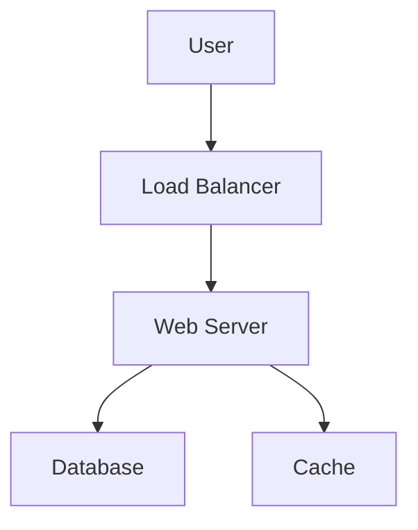

# 📚 Documentation and Maintenance Guide

## 🎯 Purpose

This template provides comprehensive guidelines for creating, maintaining, and managing technical documentation throughout the software development lifecycle, ensuring knowledge preservation and team collaboration.

## 📖 Documentation Types

### 1. **API Documentation**
- **OpenAPI/Swagger**: Interactive API specifications
- **Endpoint Documentation**: Request/response examples
- **Authentication**: Security requirements
- **Rate Limiting**: Usage constraints
- **Error Codes**: Comprehensive error handling

#### API Documentation Template
```yaml
openapi: 3.0.0
info:
  title: My API
  version: 1.0.0
  description: Comprehensive API for [purpose]

paths:
  /api/users:
    get:
      summary: Get users
      parameters:
        - name: limit
          in: query
          schema:
            type: integer
            default: 10
      responses:
        '200':
          description: Successful response
          content:
            application/json:
              schema:
                type: array
                items:
                  $ref: '#/components/schemas/User'
```

### 2. **Technical Architecture Documentation**
- **System Overview**: High-level architecture diagrams
- **Component Diagrams**: Service interactions
- **Data Flow**: Information movement through system
- **Infrastructure**: Deployment and scaling details
- **Security Architecture**: Authentication and authorization

#### Architecture Document Template
```markdown
# System Architecture: [System Name]

## Overview
Brief description of the system's purpose and scope.

## Architecture Diagram
[Include C4 model diagrams: Context, Container, Component, Code]

## Components
### Component Name
- **Purpose**: What it does
- **Technology**: Implementation details
- **Dependencies**: What it depends on
- **Interfaces**: How it communicates

## Data Flow
1. User request enters through [entry point]
2. Request is processed by [component]
3. Data is stored in [storage system]
4. Response is returned via [path]

## Non-Functional Requirements
- **Performance**: Response time requirements
- **Scalability**: Scaling patterns
- **Reliability**: Uptime and failover
- **Security**: Security measures
```

### 3. **User Documentation**
- **Getting Started**: Quick setup guides
- **Tutorials**: Step-by-step learning paths
- **How-To Guides**: Task-oriented instructions
- **Reference**: Comprehensive feature descriptions

### 4. **Developer Documentation**
- **Setup Instructions**: Local development environment
- **Code Style Guidelines**: Formatting and conventions
- **Contributing Guidelines**: How to contribute
- **Troubleshooting**: Common issues and solutions

## 📝 Documentation Standards

### Writing Guidelines

#### 1. **Structure and Organization**
```markdown
# Clear, Descriptive Titles

## Use Hierarchical Headers
### Subsections for detailed topics

- Use bullet points for lists
- Number steps in procedures
- Include code examples with syntax highlighting
```

#### 2. **Content Guidelines**
- **Be Concise**: Clear and to the point
- **Use Active Voice**: "Configure the server" not "The server should be configured"
- **Include Examples**: Real-world, working examples
- **Update Regularly**: Keep information current
- **Version Everything**: Track changes and versions

#### 3. **Visual Elements**
- **Diagrams**: Use tools like Mermaid, Draw.io
- **Screenshots**: Include relevant UI elements
- **Code Blocks**: Syntax-highlighted examples
- **Tables**: Organize complex information

### Documentation as Code

#### Version Control
```bash
# Store documentation with code
docs/
├── api/
│   ├── openapi.yaml
│   └── examples/
├── architecture/
│   ├── overview.md
│   └── diagrams/
├── user-guide/
│   ├── getting-started.md
│   └── tutorials/
└── developer/
    ├── setup.md
    └── contributing.md
```

#### Automated Generation
```yaml
# GitHub Actions for documentation
name: Generate Documentation
on:
  push:
    branches: [main]

jobs:
  docs:
    runs-on: ubuntu-latest
    steps:
      - uses: actions/checkout@v2
      - name: Generate API docs
        run: swagger-codegen generate -i openapi.yaml -l html2 -o docs/
      - name: Deploy to GitHub Pages
        uses: peaceiris/actions-gh-pages@v3
        with:
          github_token: ${{ secrets.GITHUB_TOKEN }}
          publish_dir: ./docs
```

## 🔄 Documentation Maintenance

### Regular Maintenance Tasks

#### Monthly Reviews
- [ ] Review all documentation for accuracy
- [ ] Update screenshots and UI references
- [ ] Check external links for validity
- [ ] Update version numbers and dates
- [ ] Review and respond to user feedback

#### Quarterly Updates
- [ ] Conduct comprehensive documentation audit
- [ ] Update architecture diagrams
- [ ] Refresh getting-started guides
- [ ] Review and update FAQ sections
- [ ] Analyze documentation usage metrics

### Documentation Metrics

#### Track Key Metrics
```javascript
// Example analytics implementation
{
  "pageViews": {
    "getting-started": 1500,
    "api-reference": 800,
    "troubleshooting": 300
  },
  "userFeedback": {
    "helpful": 85,
    "notHelpful": 15
  },
  "searchQueries": [
    "how to authenticate",
    "rate limiting",
    "error codes"
  ]
}
```

#### Key Performance Indicators
- **Page Views**: Most/least accessed pages
- **User Feedback**: Helpful/not helpful ratings
- **Search Queries**: What users are looking for
- **Time on Page**: Engagement metrics
- **Bounce Rate**: Content effectiveness

## 🛠️ Tools and Platforms

### Documentation Platforms

#### 1. **GitBook**
```markdown
# Advantages
- Beautiful, interactive documentation
- Git integration
- Collaborative editing
- Analytics and insights

# Use Cases
- User manuals
- API documentation
- Team knowledge bases
```

#### 2. **Confluence**
```markdown
# Advantages
- Enterprise-ready
- Rich editing capabilities
- Integration with Jira
- Team collaboration features

# Use Cases
- Internal documentation
- Project specifications
- Meeting notes and decisions
```

#### 3. **GitHub Wiki/Pages**
```markdown
# Advantages
- Integrated with code repository
- Markdown support
- Version controlled
- Free for open source

# Use Cases
- Project documentation
- Developer guides
- Open source projects
```

### Diagram Tools

#### Mermaid (Code-based)


#### Draw.io (Visual)
- Architecture diagrams
- Flowcharts
- Network diagrams
- UI mockups

## 📋 Documentation Templates

### README Template
```markdown
# Project Name

## Description
Brief description of what this project does.

## Installation
```bash
npm install project-name
```

## Usage
```javascript
const project = require('project-name');
project.doSomething();
```

## API Reference
Link to detailed API documentation.

## Contributing
See [CONTRIBUTING.md](CONTRIBUTING.md) for guidelines.

## License
This project is licensed under [License Name].
```

### CHANGELOG Template
```markdown
# Changelog

All notable changes to this project will be documented in this file.

## [Unreleased]
### Added
- New feature descriptions

### Changed
- Changes to existing functionality

### Fixed
- Bug fixes

## [1.0.0] - 2024-01-01
### Added
- Initial release
```

## 🎯 Best Practices

### Documentation Strategy
1. **Start Early**: Document as you build
2. **Keep It Updated**: Regular maintenance schedule
3. **Make It Searchable**: Good organization and search functionality
4. **Get Feedback**: Regular user input and reviews
5. **Measure Success**: Track usage and effectiveness

### Team Practices
- **Documentation Reviews**: Include docs in code reviews
- **Shared Responsibility**: Everyone contributes
- **Knowledge Sharing**: Regular documentation sessions
- **Templates and Standards**: Consistent formats
- **Continuous Improvement**: Regular process refinement

---

**Remember**: Good documentation is an investment in your project's future success and team productivity.